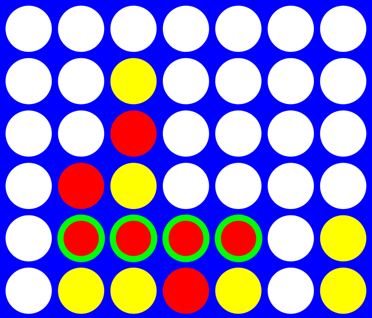

# connect-four-ai

This repository contains the Connect 4 AI I made for the final project of my Computer Science 2 course. 
The AiyazAgent.java file contains my code for the AI and the rest of the code (GUI and API) was provided by my instructor. 

### Behavior
This AI uses a minimax decision tree. 
It takes advantage of a technique called alpha-beta pruning to speed up the algorithm, so it can compute a greater depth in the minimax tree.
The algorithm can compute up to 8 levels of depth at around 1 second per move.

### License

[MIT License](LICENSE)